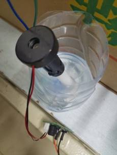

# 基于NodeMcu的智慧生态农业系统设计

## 主要用到的技术

NodeMcu + OneNET物联网平台 + Android

> 1. NodeMcu使用Arduino IDE开发，编程语言为C语言。
> 2. OneNET物联网平台 作为MQTT服务器。
> 3. Android开发使用Anroid studio IDE开发，编程语言为Java。


## 1    系统概述

### 1.1   需求分析

  传感器采集温湿度数据后，将数据上传OneNET物联网平台；Android手机端向OneNET平台获取温湿度数据并将数据显示在手机页面，并将数据进行可视化处理；手机APP可以向设备发送命令，开启风扇、水泵、加湿器，或设置空气温度阈值、空气湿度阈值、土壤湿度阈值。NodeMcu可以判断传感器获取的实时数据是否达到设定的阈值，从而决定是否开启相应设备开关。


### 1.2   工作流程


图1-1 工作流程

(1) 通过空气温湿度传感器、土壤湿度传感器采集空气温湿度、土壤湿度。

(2) 通过NodeMcu单片机处理数据并使用MQTT协议将数据上传OneNET物联网平台，NodeMcu通过判断传感器采集的数据是否达到设置的阈值决定是否开启风扇、水泵、加湿器。

(3) Android手机端向OneNET物联网平台请求温湿度数据，并显示在APP主页面和图表中。Android手机端点击设备开关按钮时，向OneNET物联网平台发送命令，OneNET物联网平台将命令发送给NodeMcu，NodeMcu控制继电器开启设备。

(4) Android手机端设置阈值，将修改后的阈值以命令的方式经由OneNET发给NodeMcu，NodeMcu更新阈值。

 

 


图1-2 Android流程图


图1-3 OneNET流程图


图1-4 NodeMcu工作流程图

## 2    系统硬件设计

### 2.1   电路图


图2-1 电路图

引脚分配：

继电器：

  IN1：D4 (GPIO:2) 风扇

  IN2: D3 (GPIO:0) 水泵

  IN3: D2 (GPIO:4) 加湿器

温湿度传感器：D5 (GPIO:14)

土壤湿度传感器：A0 

 

### 2.2   单片机


图2-2 NodeMcu单片机

​    本项目中所使用的NodeMcu单片机集成了ESP8266 WIFI模块，具有成本低、体积小等特点，是一个很好的物联网开发平台。

​    NodeMcu有17个GPIO引脚，其中GPIO6~GPIO11用于连接开发板的闪存，在其他11个引脚中有两个是RX和TX。除了GPIO接口外，NodeMcu还有ADC、SPI、I2C等接口。NodeMcu的输入电压是3.3V。模拟输入只有一个引脚A0，实现AD转换将模拟量转换成数字量，可以实现读取0~3.3V的电压。

​    集成ESP8266WIFI模块，与其他单片机需要另外单独添加一个WiFi模块相比，NodeMcu直接就集成的有现成的ESP8266 WiFi模块，而ESP8266 WiFi芯片是一种低成本、高性能的芯片，WiFi模块支持STA、AP、STA+AP、三种工作模式[15]。基于上面的原因，NodeMcu成本比较低廉，性价比很高。体积小也是NodeMcu的一个非常重要的特点，物联网设备在开发的时候体积是一个需要考虑的问题。

​    NodeMcu是一个开源的物联网开发平台，可以像Arduino一样操作硬件IO提供硬件的IO接口，可以将开发者从繁杂的硬件配置、寄存器操作中解放出来[16]。具有GPIO、PWM、I2C、1-Wire、ADC等功能，硬件配置核心模组为ESP8266，MCU为Xtensa L106、RAM 50K、flash 512K。NodeMcu有两种串口配置，CP2102 USB串口和CH340 USB串口。CP2102 USB串口可以实现即插即用，CH340 USB串口在国内用的较多，它在使用时需要安装CH340驱动。

​    GPIO2在开发板启动时，不能接低电平。在通讯方面，开发板有两个通讯串口，串口0(UART0)使用GPIO0和GPIO3引脚。其中GPIO是TX0，GPIO3是RX0，串口1(UART1)使用GPIO2和GPIO8引脚。其中GPIO2是TX1，GPIO8是RX1。由于GPIO8被用于连接闪存，故串口2只能通过GPIO2向外发送数据。

​    ESP8266只有软件模拟的I2C端口没有硬件的I2的端口。我们可以使用任意的GPIO口通过软件模拟实现I2C通信功能。SPI端口情况，GPIO14: CLK,GPIO2: MISO, GPIO13: MOSI,GPIO15: CS(SS)。

 

### 2.3   传感器

2.3.1 DHT11温湿度传感器


图2-3 DHT11温湿度传感器


图2-4 DHT11电路原理图


图2-5 DHT11外观图

 

表3-1 DHT11引脚说明

| Pin  | 名称             | 注释      |
| ---- | ---------------- | --------- |
| VDD  | 供电             | 3－5.5VDC |
| DATA | 串行数据，单总线 |           |
| NC   | 空脚             |           |
| GND  | 接地，电源负极   |           |

 

​    DHT11是一种数字温湿度传感器，具有高可靠性的特点和优异的长期稳定性的特点，其采用专用的数字模块采集技术以及温湿度传感技术。该传感器由电阻式感湿元件和NTC测温元件组成，并与高性能8位单片机相连接，具有响应快、抗干扰能力强和性价比高等优点[17]。每个DHT11传感器都在非常精确的湿度校验室中进行校准，校准系数以程序的形式存储在OTP内存中，并在检测信号的处理过程中被调用。该传感器采用单线制串行接口，使得系统集成变得简单方便，且具有超小的体积、极低的功耗和信号传输距离可达20米以上的特点，适用于暖通空调、测试及检测设备、汽车、数据记录器、消费品、自动控制、气象站、家电、湿度调节器、医疗和除湿器等多个领域的应用。

 

2.3.2 土壤湿度传感器


图2-6 土壤湿度传感器


图2-7 土壤湿度传感器外观图

本项目使用的土壤湿度传感器(XH-M214)，工作电压3.3V-5V。土壤水分多少会影响土壤的电导率、电阻，水分越大，电阻越小，导电功能越强。土壤湿度传感器的原理是通过测量两个电极之间的电阻值，来确定土壤湿度值大小。模块中的电位器可以调节阈值，顺时针调节，阈值越大，数字量输出D0可以与单片机直连，土壤湿度低于设定值时，D0输出高电平，高于设定值时，D0输出低电平[18]。该土壤湿度传感器输出的是模拟信号，连接NodeMcu的A0引脚，输出值范围为0至1024。

 

### 2.4   继电器

2.4.1 原理


图2-8 继电器

继电器的作用实际上就是作为一个通过高低电平控制的开关，继电器可以设置高电平触发和低电平触发两种模式，我这里是设置的是高电平触发。当NodeMcu给它一个高电平时，开关闭合。在本项目中我所使用的继电器是四路继电器，相当于四个开关。

引脚说明：

DC+、DC-: 继电器模块电源正负极（连接NodeMcu单片机）。

IN1-IN4: 输入控制信号。

NO: 常开端（开关的一端）。

COM: 公共端（开关的另一端）。

NC: 常闭端（不用）。

第1至3号开关依次控制风扇、水泵、加湿器，分别由IN1、IN2、IN3控制。

当空气温度达到阈值或手机开启风扇开关时，NodeMcu就会给IN1一个高电平，风扇就会开启；当土壤湿度达到阈值或手机开启水泵开关时，NodeMcu就会给IN2一个高电平，水泵就会开启；当空气湿度达到阈值或手机开启加湿器开关时，NodeMcu就会给IN3一个高电平，加湿器就会开启。

 

### 2.5   外部设备

2.5.1 风扇


图2-9 风扇

  本项目使用的电机是140型微型直流小马达，额定电压3V，转速14200rpm。本项目所使用的电机仅供演示使用，在具体情境中，可以根据自己的具体需求更换为指定规格的电机。因为电机的开关是通过继电器控制的，所以电机可以直接更换，无需担心额外的细节问题，可以直接应用于实际的农业生产活动。

 

2.5.2 水泵


图2-10 水泵

  本项目使用的水泵工作电压5V，这种电机是有刷电机，寿命没有无刷的长。本项目中使用的水泵的规格比较小，只适合用于演示功能和浇花，不能用于具体的生产活动。在具体的农业生产中，可以将水泵替换为功率和规格比较大的水泵。

 

2.5.3 加湿器



图2-11 加湿器

  本项目使用的加湿器额定电压5V，喷雾原理是微孔雾化片压电陶瓷带动金属片高频振动，超声波将水雾化。微孔雾化片是由压电陶瓷和金属片组成，通过驱动电路板输出PWM脉宽调制，使压电陶瓷产生每秒几十万次的高频谐振，带动金属片振动。将水从金属片中上千个微孔中喷出，形成4-6微米水分子将液态水分子结构打散，形成水雾。本系统使用的加湿器功率比较小，只作为演示使用，在具体的生产环境中可以采用符合具体生产环境需求的加湿器。

## 3 代码分析

3.1.1     发送数据

​    通过mqttClient.publish()函数可以向OneNET平台的系统主题发布消息。mqttClient.publish函数总共有三个参数，格式为mqttClient.publish(订阅主题，有效数据，有效数据长度)，被发送的数据以JSON格式存储。

​    具体操作过程是，首先用字符数组约定发送数据的格式，

​    例如：{\"id\":\"temperature\",\"datapoints\":[{\"value\":%f}]}

​    然后通过sprintf()函数将具体的数据传入字符数组中。

​    例如：sprintf(json, JsonStr, tem, hum, soilHumidity);

​    最后，通过mqttClient.Publish("$dp", data, jsonlen+3)将数据发送到OneNET云平台。其中$dp是订阅的系统主题。

 

1.1.2     接收处理命令

**订阅系统命令主题**

​    要想接收到OneNET发来的命令，就要先订阅系统命令主题，系统命令主题格式如下：

```
  $sys/586987/温湿度传感器/cmd/#

  $sys/产品号/设备名称/cmd/#
```

​    NodeMcu在订阅系统命令后，用户通过安卓手机端通过OneNET云平台提供的API发送命令，NodeMcu通过回调函数可以获取用户发送的命令。

 

```c
// 订阅指定主题

void subscribeTopic(){

 String topicString = "$sys/586987/温湿度传感器/cmd/#";

 char subTopic[topicString.length() + 1];  

 strcpy(subTopic, topicString.c_str());

 

 // 通过串口监视器输出是否成功订阅主题以及订阅的主题名称

 if(mqttClient.subscribe(subTopic)){

  Serial.println("Subscrib Topic:");

  Serial.println(subTopic);

 } else {

  Serial.print("Subscribe Fail...");

 }  

}
```

 

**用回调函数获取OneNET****发来的命令**

​    Callback函数是一个已经定义好的函数，它接收三个参数：主题名、消息负载、以及消息长度。当有消息到达时，回调函数会自动调用，并将消息负载和长度传递给函数内部进行处理。在函数内部，首先定义一个字符型数组cmd[length]，并通过循环遍历将消息负载中的每一个字节存储到cmd数组中，并将其在串口打印输出。接着，使用arduinoJson库中的deserializeJson()函数对cmd数组进行反序列化，将其转换为JSON格式，并将数据存储到jsonBuffer中。如果在反序列化过程中出现错误，则会通过串口输出相应的错误信息。

 ```c
 void Callback(char* topic, byte* payload, unsigned int length) {
 
  char cmd[length];
 
  for (int i = 0; i < length; i++) {
 
   Serial.print((char)payload[i]);
 
   cmd[i] = payload[i];   
 
  }
 
  DeserializationError error = deserializeJson(jsonBuffer, cmd);
 
  if (error) 
 
  {
 
   Serial.print(F("deserializeJson() failed: "));
 
  }
 
 }
 ```


**处理命令**

​    当单片机接收到数据后，用ArduinoJson库StaticJsonDocument类型的变量jsonBuffer将命令存储，然后可以用jsonBuffer[“key”]的形式获取key的值。系统发送的命令有switch_fan、switch_waterPump、switch_humidifier、limitTemperature、limitHumidity、limitSoilHumidity，分别标志着风扇、水泵、加湿器的开关状态、空气温度阈值、空气湿度阈值、土壤湿度阈值。我们要从jsonBuffer中提取这些命令，就要用jsonBuffer[“key”]的形式获取key的值获取这些命令的值，在此之前，必须要做的一件事就是首先要判断jsonBuffer中是否包含该命令，就要用到StaticJsonDocument的containsKey方法去判断。

​    使用jsonBuffer存储命令有助于将命令以JSON格式存储在内存中，方便后续处理。要获取某个命令的值，可以使用json[“key”]的形式，jsonBuffer中的数据以key-value键值对形式存储，其中key对应着命令名称，value对应着它的状态值。例如，要获取风扇的状态值，就可以使用jsonBuffer[“switch_fan”]。在获取命令之前，必须先判断jsonBuffer中是否包含该命令。这是因为，如果jsonBuffer中不包含该命令的话，获取的数值将是错误的。为了避免这种情况发生，可以使用StaticJsonDocument的containsKey方法来判断jsonBuffer中是否包含指定的命令。例如，如果要检查jsonBuffer中是否包含风扇状态值，可以使用jsonBuffer.contaisKey(“switch_fan”)。

​    下面以获取风扇开关状态命令为例：

```c
  if(jsonBuffer.containsKey("switch_fan")) {

    switch_fan = jsonBuffer["switch_fan"];

    Serial.print("switch_fan");

    Serial.println(switch_fan);       

  } 
```

  StaticJsonDocument 是就地分配其内存池的 JsonDocument，因此它不依赖于动态内存分配。因为它不调用malloc()和free()，所以 StaticJsonDocument 比 DynamicJsonDocument 稍快。如果你声明了一个StaticJsonDocument类型的局部变量，它会在栈内存中分配内存池。注意不要在堆栈中分配太大的内存池，因为它会导致堆栈溢出。对小文档（小于 1KB）使用StaticJsonDocument，如果它太大而不适合堆栈内存，则切换到DynamicJsonDocument。

 

## 3    MQTT服务器（OneNET物联网平台）

### 3.1   平台介绍

​    OneNET是中国移动开发的物联网云平台，支持多种通信协议，包括HTTP、MQTT、CoAP、LwM2M等行业标准协议以及私有协议。可以连接数亿计物联网设备，具有海量连接的特点；具有百万级吞吐量，可满足低时延、高可靠的数据收发需求。在城市运营中心、智能井盖、智慧停车、能源表计、消防烟感、环境监测、智慧教育、工业物联网等场景有比较成熟的解决方案。在智慧生活方面的应用有智能单品、智慧社区、全屋智能、智慧酒店、智慧照明。在新零售方面的应用有AI人脸融合、智能支付播报音响、智慧农业新零售。智慧教育方面的应用有OneNET学院。

​    产品ID：当我们在OneNET云平台创建一个产品后，系统会为产品自动生成一个唯一的产品ID。

​    APIKey：用于对OneNET操作的鉴权以及权限控制，例如，在本项目中，安卓手机在向OneNET云平台发送数据请求时，在HTTP报文中必须加入APIKey，用来判断是否有查看数据的权限。APIKey又分为MasterKey和设备APIKey，MasterKey具有最大权限，对该产品下的所有设备都有操作权限，能够访问本产品下的任何资源，而设备APIKey的权限仅限于本设备，只有对具体产品的操作权限，无法对同一产品下的其他设备进行操作，

​    鉴权信息：用户在OneNET云平台创建设备时，如果选择的是MQTT协议，就需要填写鉴权信息。鉴权信息由用户自己设置，用户可以自定义鉴权信息，但是要确保每一个设备的唯一性。

​    数据流：一个数据流可以理解为一类数据，例如本项目中用到的空气温度、空气湿度、土壤湿度。用户可以自己命名数据流名称，一个设备可以添加多条数据流。

​    数据点：是指一个数据流中的一个具体值，数据点按key-value的形式存储，其中key可以是时间、设备ID、数据流ID等信息。

​    OneNET提供丰富的API接口，用户可以使用API进行设备管理、数据查询、设备命令交互等操作。


图4-1 OneNET


图4-2 OneNET产品管理界面


图4-3 OneNET产品管理界面


图4-4 OneNET设备管理界面

### 3.2   接收数据

​    OneNET服务器通过MQTT协议接收到NodeMcu发来的空气温湿度数据、土壤湿度数据，这些数据有temperature、humidity、soilHumidity、limitTemperature、limitHumidity、limitSoilHumidity六个参数，它们分别表示空气温度、空气湿度、土壤湿度、温度阈值、空气湿度阈值、土壤湿度阈值。这些数据都是以JSON格式接收。OneNET物联网平台提供了非常简便的操作接口，我们无需关注OneNET具体的数据接收和存储过程的细节问题，只需要直接调用它提供的的调用API接口就行了。

 


图4-5 OneNET接收设备发来的数据流

### 3.3   下发命令

​    OneNET为用户提供有下发命令的API接口，通过OneNET发送命令的具体方法是向[URL:http://api.heclouds.com/cmds](URL:http://api.heclouds.com/cmds)发送post请求，在下发命令后，如果设备订阅了系统主题，就会获取到命令。用户不用过多的了解命令发送过程的细节问题，可以直接调用OneNET提供的API接口，在URL后面加上命令的具体内容。操作简单明了，给用户减轻了很多负担。在本项目中，命令发送主要还是采用JSON格式发送。

 

## 4    系统软件设计

### 4.1   页面布局

4.1.1 <CardView>


图4-1 卡片布局

​    本项目的Android手机端的界面主要采用了<CardView>布局，整个界面用一张张卡片形式呈现，布局美观简洁，卡片上面会显示从OneNET平台请求的空气温湿度数据、土壤湿度、阈值数据，并且当点击卡片后，会跳转到实时数据表格详情页面，对数据进行可视化展示，这样数据更加直观明了。

 

4.1.2     <Switch>


图4-2 开关界面

​    设备的开关界面是通过Android组件<Switch>实现的，当开关状态发生改变时，打开或者关闭，会触发相应事件，这些设备的开启、关闭状态通过一个整型变量用0、1标志，0标志设备关闭、1标志设备开启，当<Switch>组件开启时，Android端通过OneNET提供的发送命令的API向设备发送设备状态，设备收到命令后，将相应的设备状态更新，从而达到控制远程设备开关的目的。

4.1.3 阈值设置

​    阈值设置是通过OneNET云平台提供的API向设备发送新设置的阈值的。通过EditText输入用户想要设置的阈值，点击“修改”按钮后触发点击事件，执行下列操作（以设置温度阈值为例）：

​    按下面的格式发送POST请求：

​    http://api.heclouds.com/cmds?device_id=device_id

​    {“limitTemperature”:30}

​    http://api.heclouds.com/cmds?device_id=device_id是OneNET提供的API接口，其中device_id为设备id。


图5-3 阈值设置界面

### 4.2   获取数据

​    请求数据的方法：通过OneNET云平台提供的数据流查询API接口

​    请求方式：GET

URL: http(s)://api.heclouds.com/devices/device_id/datastreams/datastream_id

其中datastream_id是数据流名称，比如要请求空气温度数据就要向下列url发送GET请求：

http(s)://api.heclouds.com/devices/device_id/datastreams/temperature

 ```java
 OkHttpClient client = new OkHttpClient();
 Request request = new Request.Builder()
     .url(setUrl(device_id, "temperature"))
     .addHeader("api-key", api_key)
     .addHeader("Content-Type","application/json")
     .build();
     Response response = client.newCall(request).execute();
 String responseData = response.body().string();
 Log.w("test", responseData);
 ```


### 4.3   数据处理

**OneNET响应请求返回的数据（JSON格式）：**

```java
{
  "errno": 0,
  "data": {
    "count": 3,
    "datastreams": [
      {
        "datapoints": [
          {
            "at": "2023-04-05 18:17:54.537",//时间
            "value": 20.6//温度
          },
          {
            "at": "2023-04-05 18:17:53.225",
            "value": 20.6
          },
          {
            "at": "2023-04-05 18:17:51.896",
            "value": 20.6
          }
        ],
        "id": "temperature"
      }
    ]
  },
  "error": "succ"
}
```

​    要从JSON数据中提取有用的数据，需要定义与JSON数据对应的Java类JsonRootBean、Data、DataStreams、Datapoints，然后使用Gson库的fromJson方法将Json数据转换成Java对象。JsonRootBean类表示整个数据，该类包含一个errno字段、一个data字段和一个error字段。其中erron表示调用错误码，值为0时表示调用成功，格式为int；data字段为接口调用成功后设备返回的数据，格式为JSON格式；error字段为错误描述，格式为string，“succ”表示调用成功。Data类用于表示数据流中的data部分，其中包含一个count字段和一个datastreams字段。Count表示数据点的个数，datastreams表示具体的数据流。DataStreams用于表示数据流中的datastreeams部分，包含datapoints和id字段，datapints表示数据点，id为数据流ID。DataPoints类用于表示数据点，数据点中有at字段和value字段，at字段用于表示数据获取的时间，value字段用于表示具体的数据参数。

​    下面是使用Gson库解析Json数据的一个示例：

```java
    String jsonData = "..." // 从OneNET平台响应的JSON数据中获取数据
    Gson gson = new Gson();
    JsonRootBean rootBean = gson.fromJson(jsonData, JsonRootBean.class);//将收到的数据转化成Java对象。
```

​    在定义好的JsonRootBean、Data、Datastreams、Datapoints类中，都定义了get方法，通过get方法可以获取到对应类型的数据对象。获取他们的方法分别是getData()、getDatastreams()、getDatapoints()。

例如：

```java
List<Datastreams> streams_humidity = app1.getData().getDatastreams();
List<Datapoints> points_humidity = streams_humidity.get(0).getDatapoints();
humidity = points_humidity.get(1).getValue();
```

 

### 4.4   数据可视化


图5-4 数据可视化界面

​    数据可视化用的是**百度开源图表框架ECharts.js**，该框架图标类型丰富，操作简单。在Android中使用ECharts进行数据可视化的方法具体如下：

(1)  WebView

​    由于echarts是用javascript写的，他只能在html页面上显示，所以就要用到WebView组件，将html文件加载出来。在本项目中，自定义了一个视图EChartsView，内置一个WebView，然后创建了一个EChartsWebClient,用于传递数据，因此，需要用到数据可视化的时候，直接创建一个EchartsView就行了。

(2)  数据获取

​    实时数据是在MainActivity执行数据请求时，用List将温湿度数据和对应的时间点数据存储，当数据数量达到限定数据个数（21个）时，将list的第一个数据移除。在数据可视化的activity中import MainActivity这个类，并利用他的温湿度数据。

空气温度数据列表

```java
public static List<String> temperature_data_list = new Vector<>();
public static List<String> temperature_time_list = new Vector<>();
```

以温度数据list处理为例：

```java
temperature_data_list.add(String.format("%.1f",temperature));//添加温度数据
temperature_time_list.add("\"" + temperature_time + "\"");//添加温度对应的时间点
```

```java
//温度数据和时间数据列表长度大于21时，移除第一个数据。
if(temperature_data_list.size() > 21) {
    temperature_data_list.remove(0);//移除温度数据列表中的第一个元素
    temperature_time_list.remove(0);//移除温度数据对应的时间列表中的第一个元素
}
```

(3)   图表初始化

​    首先要为Echarts准备一个DOM，id设置为main，然后基于事先准备好的DOM初始化Echarts实例，具体方法是在javascript代码中调用echarts.js的setData()方法，在setData()方法中，执行echarts.init()对图表进行初始化，echart.init()方法中要传入预先准备好的DOM元素main，通过document.getElementById(“main”)获取该DOM元素。Echarts初始化后，通过myCharts.setOption(option)方法实现对图表的渲染，其中option是Echart提供的图表设置功能，用字符串格式输入，在option里面有对图表类型、图表数据、图表内容设置选项。通过WebView的回调函数onPageFinished在WebView加载完毕后，注入一段JavaScript代码，在Java代码中实现对图表内容的设置，将图表需要的数据作为参数输入，这样，在WebView加载完毕后，就会绘制出相应的图表。

 ```js
 function setData(option) {
        // 基于事先准备好的dom，初始化echarts实例
        var myChart = echarts.init(document.getElementById('main'));
        myChart.setOption(option);
     }
 ```

```java
 public void onPageFinished(final WebView view, String url) {
    super.onPageFinished(view, url);
    view.post(new Runnable() {
      @Override
      public void run() {
        view.loadUrl(String.format("javascript:setData(%s)", data));
      }
    });
  }
```


(4)  动态更新

​    利用Java的Timer类实现定时更新功能，每秒钟更新一次数据。Timer类实现的是定时器功能，它有一个schedule方法，用于指定具体的任务给定时器，在schedule方法中，还可以设置定时的时间，也就是每隔多久时间执行一次指定的任务。Timer中需要有一个Task类，用于表示定时器中指定执行的任务。

```java
timer = new Timer();

timerTask = new TimerTask() {
    @Override
    public void run() {
       更新数据
    }
};
timer.schedule(timerTask, 0,1000);

public void updataData(String data) {
    webView.evaluateJavascript(String.format("javascript:setData(%s)", data), null);
}
```

### 4.5   发送命令

请求方式：POST

请求示例：


​    向该URL发送一个HTTP POST请求，并将命令以字符串的形式发送命令，数据格式为JSON格式，即可实现命令发送功能。在本项目中，是使用HttpURLConnection实现的POST请求，具体操作流程如下：

​    创建一个HttpURLConnection对象，设置连接超时时间和读取超时时间，设置请求方式为POST，并设置请求头部信息，其中有两个参数，api_key和device_id，api_key是用于判断该请求是否有对该设备的操作权限，device_id是设备号，用于表示特定的设备。还要设置允许输入输出流。需要创建一个DataOutStream对象，将要发送的数据写入其中。获取服务器返回的HTTP状态码，如果状态码不是HTTP_OK(200)，就抛出一个异常。从输入流中读取服务器返回的数据，并将其转换成字符串类型。如果返回结果为空，就说明发送失败，输出一个“发送失败了”；如果返回结果不为空，就说明发送成功了，就输出一个“发送成功了”。