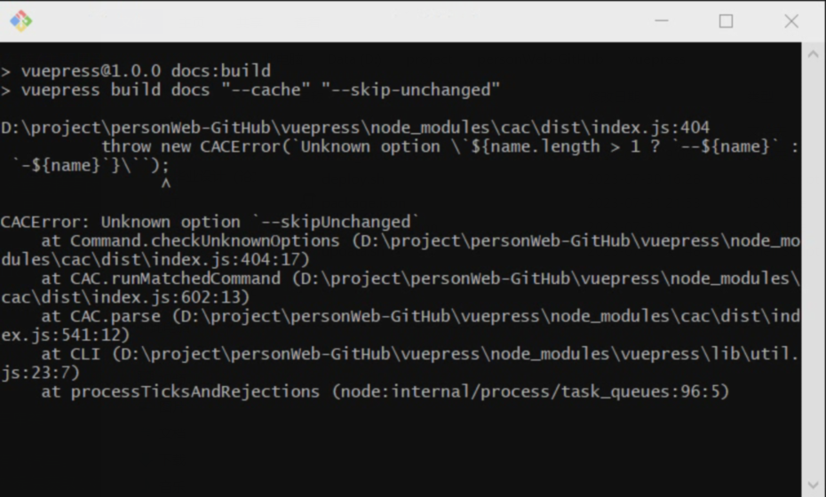
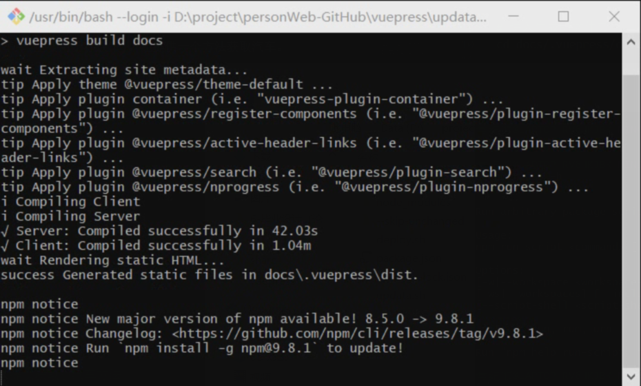

# VuePress + github 搭建个人博客

## 注意事项（容易踩的坑）

### 1.侧边栏配置路径问题

如果有一个路径名有问题，那么这侧边栏分组都不会显示。

### 2.为每一个导航栏配置侧边栏

> 踩坑点：主页的配置要放在最后，因为主页的路径为"/"，当你点击导航栏的时候，他会从第一个路径开始匹配，这样一来，如果把"/"放在最前面的话，那样就不管是提供的哪个路径，"/"都会匹配上。

```js
//主页侧边栏配置
```


```js
module.exports = {
  title: '琅玕的博客',
  description: '个人编程技术分享',
  themeConfig:{
  nav: [{text: "主页", link: "/"      },
      { text: "项目", link: "/project/" },
      { text: "技术", link: "/skills/"},
      { text: "算法", link: "/algorithm/"   },
      { text: "资源分享", link: "/share/"   },
    ],
  // sidebar: 'auto',
  sidebar: {
    '/project/':[
      {
        title: '项目',
        collapsable: false, // 不折叠
        // sidebarDepth: 3,
        children: [
            { title: "1", path: "/" }
        ]
    },
    {
      title: "物联网",
      collapsable: false, // 不折叠
      children: [
        { title: "条件类型", path: "/1" },
        { title: "泛型", path: "/2" }
      ],
    }
    ],

    '/':[
        {
          title: '欢迎学习',
          path: '/',
          collapsable: false, // 不折叠
          // sidebarDepth: 3,
          children: [
              { title: "学前必读", path: "/" }
          ]
        },
        {
          title: "物联网",
          collapsable: false, // 不折叠
          children: [
            { title: "条件类型", path: "project/1" },
            { title: "泛型", path: "project/2" }
          ],
        }
      ],
  }
  } 
}


```

下面的代码中的path属性是当前目录直接显示的内容资源获取路径（也就是物联网目录下直接显示的内容路径），后面的children的路径不会参考这个路径，没有直接联系。我一开始以为是将该路径设置为当前目录的路径，后面的children可以以此为相对路径。这是错误的想法。后面的children的相对路径还是从外面定义的‘project’开始的。

```js
'/project/':[
      {
        title: '项目',
        path:'/',
        collapsable: false, // 不折叠
        // sidebarDepth: 3,
        children: [
            { title: "1", path: "/" }
        ]
      },
      {
        title: "物联网",
        path:'/project/IoT/',
        collapsable: false, // 不折叠
        children: [
          // { title: "条件类型", path: "/1" },
          // { title: "泛型", path: "/2" },
          "1",
          "2",

          // "",
          "基于NodeMcu的智慧生态农业系统"
          // {title:"基于NodeMcu的智慧生态农业系统设计",path:"基于NodeMcu的智慧生态农业系统设计"}
        ],
      }
    ],
```


### 3. 图片路径问题

markdown中的图片是按照相对路径存储的，但是vuepress在创建静态网页的时候，无法获取图片，这是因为路径解析的问题。vuepress相对路径的解析方式和markdown的路径解析方式不同，需要添加一个插件。


侧边栏分组中调用.md文件必须使用从根路径(docs)开始的路径？

在命令行窗口输入ctrl + c 可退出本地服务器预览


VuePress是一个静态网站生成器，通常与Git版本控制系统一起使用。要只提交VuePress文档中修改的部分，您需要通过以下步骤进行操作：

1. 确保您已经初始化了一个Git仓库并与VuePress项目绑定。
2. 在做修改之前，首先使用以下命令查看您的修改状态：

```bash
git status
```

这将列出所有已修改和未提交的文件。

1. 使用以下命令来查看您的修改内容：

```bash
git diff
```

这将显示所有修改的内容。请确保仔细检查和确认您的修改。

1. 如果您想将所有修改的内容一起提交，可以使用以下命令：

```bash
git add .
```

这将将所有修改的文件添加到暂存区。

1. 接下来，使用以下命令进行提交：

```bash
git commit -m "您的提交消息"
```

请确保在提交消息中描述清楚您的修改内容。

1. 如果您只想提交部分修改，可以使用以下命令逐个选择文件进行添加：

```bash
git add path/to/modified/file
```

替换`path/to/modified/file`为您要提交的特定文件路径。

1. 然后，再次使用以下命令进行提交：

```bash
git commit -m "您的提交消息"
```

这将提交您选择的部分修改。

1. 最后，使用以下命令将更改推送到远程仓库：

```bash
git push origin master
```

这会将您的修改推送到远程仓库。

请注意，这些步骤都是在命令行中完成的。如果您使用的是图形化的Git客户端，那么也会有相应的选项来添加和提交部分修改。






```sh
# 生成静态文件，只生成修改了的部分
npm run docs:build --cache --skip-unchanged
```

我太难了

666666666666666666666666666666

7777777777777
