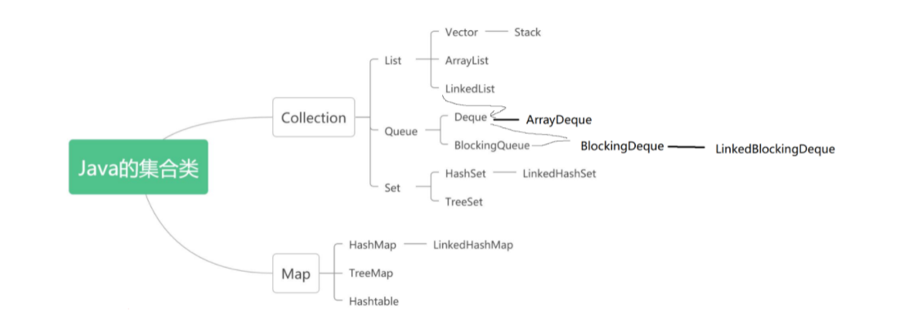

# Java的集合类

## 集合

> 在Java中，集合指的就是存放数据的容器，是一个载体，可以一次容纳多个对象。

和数组比较像，那为什么要提供一套集合类？就是因为数组操作起来麻烦，容易出bug。集合类帮助我们把操作数组这个过程隐藏起来了，数组长度不够就扩容，删除数据的时候就挪动数据。



## Collection

### 1. Collection接口的作用

### 2. Collection的增删查

增：add()、addAll()

删：remove()、removeAll(Collection<?> c)

查：contains(Object o)、containsAll(Collection<?> c)

取交集：retainsAll(Collection<?> c)

其他：clear()、equals(o)、hashCode()、isEmpty()、size()

### 3. Collection的遍历方法

#### 3.1 toArray方法

将Collection转化为数组，然后通过遍历这个数组来遍历这个Collection。

toArray方法有两种：有参和无参

无参：

```java
public Object[] toArray() {
    return Arrays.copyOf(elementData, size);
}
```


有参：

```java
class ArrayList {
    //底层数组及长度
    Object[] elementData;
    int size;
    
    public <T> T[] toArray(T[] a) {
        //当传入的数组长度小于集合长度，直接复制底层存储的数据
        if(a.length < size)
            return (T[]) Arrays.copyOf(ElementData, size, a.getClass());
        //只要走到这一步，就说明传入的数组长度大于等于集合的长度，直接把底层的数组复制给传入的数组
        System.arrayCopy(elementData, 0, a, 0, size);
        
        //如果传入的数组长度大于size，就把第一个空余的位置赋值null
        if(a.length > size) 
            a[size] = null;
        return a;
    }
}
```

有参和无参的区别：


#### 3.2 iterator方法

迭代器， 又称光标(cursor)

迭代器在使用的过程中，如果原有结构发生改变，就会报错(ConcurrentModificationException)，不允许使用迭代器外部的方法对迭代对象进行修改。比如删除，ArrayList<String> list的一个元素，不能用，list.remove()，只能用iterator.remove().

迭代器的使用方法：

```java
Collection<String> list = new ArrayList<>();

Iterator<String> iterator = list.iterator();
while(iterator.hasNext()) {
    String s = iterator.next();
}

Iterator<String> listIterator = list.listIterator();
while(iterator.hasNext()) {
    String t = listIterator.next();
}
```


#### 3.3 for-each

for-each语句的底层也是iterator


### 4. 迭代器常见的bug


##  List

### 常用API

add()、addAll()

remove()

set()

get()

indexOf()

lastIndexOf()

listIterator()

subList()

|            | 底层结构 | 存储是否有序 | 是否允许重复 | 是否允许存储null |
| :--------: | :------: | :----------: | :----------: | :--------------: |
| ArrayList  |   数组   |     有序     |     允许     |       允许       |
|   Vector   |   数组   |     有序     |     允许     |       允许       |
| LinkedList |   链表   |     有序     |     允许     |       允许       |

1. 实现了哪个接口：
2. 数据结构：
3. 底层结构：
4. 存储是否有序：
5. 存储null：
6. 存储重复元素：

### Stack

Stack效率很低，使用Deque来代替Statck

```java
Deque<Integer> stack = new ArrayDeque<integer>();
```

## Queue

|                                 |       父类接口       |      数据结构      | 底层结构 | 存储是否有序 | 是否允许重复 |        是否允许存储null        |
| ------------------------------- | :------------------: | :----------------: | -------- | :----------: | ------------ | :----------------------------: |
| Queue(接口)                     |      Collection      |        队列        |          |     有序     | 允许         |              不能              |
| Deque(接口)                     |        Queue         | 队列、栈、双端队列 |          |     有序     | 允许         | 不能存储null（LinkedList除外） |
| **ArrayDeque(实现类)**          |        Deque         | 队列、栈、双端队列 | 循环数组 |     有序     | 允许         |              不能              |
| BlockingQueue(接口)             |                      |                    |          |              |              |                                |
| BlockingDeque(接口)             | BlockingQueue、Deque |                    |          |              |              |                                |
| **LinkedBlockingDeque(实现类)** |    BlockingDeque     |                    |          |              |              |                                |

极端条件下两组API对比：

|           |          抛出异常          |        返回特殊值         | 阻塞队列 |      阻塞超时       |
| :-------: | :------------------------: | :-----------------------: | :------: | :-----------------: |
| 队满 插入 |           add(e)           |       offer(e) 入队       |  put(e)  | offer(e, time,unit) |
| 队空 移除 |          remove()          |        poll() 出队        |  take()  |  poll(time, unit)   |
|   检查    | element() 获取但不移除队头 | peek() 获取队头但是不出队 |    -     |          -          |


### 1. 子接口Deque(双端队列)

Deque

|      | 作为双端队列  |              | 作为普通List  |              | 作为Queue |  作为Stack   |
| :--: | :-----------: | :----------: | :-----------: | :----------: | :-------: | :----------: |
|      |      头       |      尾      |       -       |      -       |     -     |      -       |
| 插入 | offerFirst(e) | offerLast(e) |  addFirst(e)  |  addLast(e)  | offer(e)  | push()(入栈) |
| 移除 |  pollFirst()  |  pollLast()  | removeFirst() | removeLast() |  poll()   |  pop(出栈)   |
| 获取 |  peekFirst()  |  peekLast()  |  getFirst()   |  getLast()   |  peek()   |      -       |

实现类：ArrayDeque

初始容量16，扩容*2

### 2. 子接口BlockingQueue(阻塞队列)

 -> 子接口BlockingDeque -> 实现类：LinkedBlockingDeque

阻塞队列是一个大小有限的队列。

- 插入时，当队列满了，插入线程阻塞。
- 从队列中获取元素时，当队列空了，获取线程阻塞。

## Set

|               |  父类接口  | 数据结构 |     实现      | 存储是否有序 | 是否允许重复 | 是否允许存储null |
| :-----------: | :--------: | :------: | :-----------: | :----------: | :----------: | :--------------: |
|   Set(接口)   | Collection |   集合   |       -       |      -       |    不允许    |        -         |
|    TreeSet    |    Set     |          |    TreeMap    |   大小有序   |    不允许    |      不允许      |
|    HashSet    |    Set     |          |    HashMap    |     无序     |    不允许    |       允许       |
| LinkedHashSet |  HashSet   |          | LinkedHashMap |     有序     |    不允许    |       允许       |

### 1. TreeSet大小比较标准

重写比较对象的比较方法。

1. 为比较对象对应的类实现Comparable接口，重写比较方法。
2. 在TreeSet构造器中传入一个比较器。

### 2. 重复的判断标准

1. TreeSet: Comparable返回0
2. hashCode && equals
