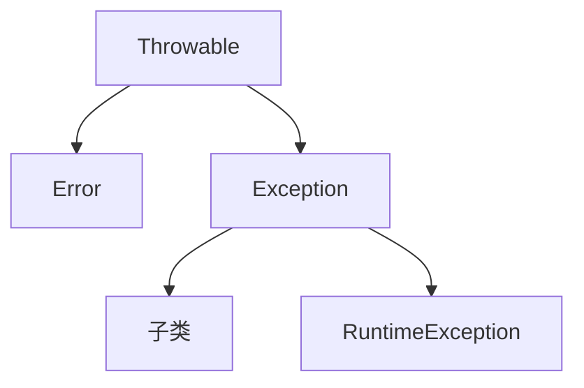

# Java常用API
## 一、Object
> Object类是所有类继承层次的祖先类

### 1. public final Class getClass()
> 提供一种获取Class对象的方式
> Class对象（运行时类对象）：封装了该类的类型信息。比如类的名字、所处包、成员、静态成员、构造器等。是某个类在其类加载时期，由JVM在堆上自动创建生成的一个对象（Class对象）。由于类加载只有一次，所以类的Class对象也是唯一的。    

可以调用getClass()方法通过“==”判断两个对象的类型是否一致。
Class API实际上是反射的原理。
getName(): 获取全限定类名
getSimpleName(): 获取简单类名

### 2. public String toString()
toString()的作用：
(1) 返回该对象的字符串表示（打印对象属性取值）。
(2) 建议所有子类重写次方法。
Object类当中的toString方法默认实现

    return 全限定类名 @ 该对象的十六进制地址值字符串
    return this.getClass().getName() + "@" + Integer.toHexString(hasCode());
(3) 可以alt + insert快捷键生成toString()重写。

### 3. public boolean equals(Object object)
重写equals方法的原则：
(1) 自反性：自己和自己比较一定返回true。
(2) 排他性：当对比的不是同种类型的对象或是一个null时，默认返回false
(3) 对称性：
(4) 传递性：
(5) 一致性：
```java
    @Override
    public boolean equals(Object o) {
        //1.自反性
        if(this == o) {
            return true;
        }

        //2.排他性
        if(!(o instanceof Animal)) {
            return false;
        }

        //3.属性取值比较
        Animal a = (Animal) o;
        if(age != a.age) {
            return false;
        }
        if(name != a.name) {
            return false;
        }
        return price == a.price;
    }
```
### 4. public int hashCode()
> 哈希映射：将一组关键字**映射**到一个有限的、连续的地址集（区间）上。
> hashCode()方法：就是一个哈希函数，用于计算哈希值。

1. 为什么要同时重写equals方法和hashCode方法？为什么equals返回true时hashCode返回值必须一致？
因为哈希表中key值是唯一的不允许重复，如果插入一个相同的key，那么他会覆盖原来的key，既然是覆盖，那么新的key和旧的key插入的位置应该一致，所以他们的哈希值应该一致。所以，当两个对象“相等”时，他们的插入位置应该一致，哈希值应该一致。

2. Object类的hashCode方法默认实现会返回该对象的十进制地址值。Object类的默认hashCode方法是一个本地方法，一般是通过将该对象的内部地址转换成一个int整数来实现的。 

### 5. pretected void finalize()
### 6. pretected Object clone()
1. clone方法使用步骤：
    (1) 重写访问权限
   Object类的访问权限是protected，子类要想在该类的外部调用clone方法，就要在该类中重写clone方法的访问权限。

    (2) 重写clone方法的方法体
    一般不需要，

    (3) 重写方法的返回值类型，从Object改为自身类型
    (4) 实现接口java.lang.Cloneable，表示该类允许进行克隆。
    Cloneable接口是一个空接口，实现了就允许做XX操作，不实现就不允许甚至抛出异常，这样的接口称之为“标记接口”。

2. 克隆操作的两个概念
    (1) 浅克隆/浅拷贝
    Object类中的clone方法的默认实现就是浅克隆/浅拷贝。
    引用数据类型的成员变量拷贝的是原来的引用（对象的地址值），仍然指向原来的对象。
    (2) 深克隆/深拷贝
    无论对象中有无引用数据类型的成员变量，都要确保克隆后得到完全独立的新对象。
    深克隆的一种实现方法：
    I. 深克隆是在浅克隆的基础上实现的，首先要做浅克隆。
    II. 将对象中引用指向的对象再克隆一个新对象
    III. 将克隆对象的克隆引用指向克隆后的新对象。
    （II、III通过重写原对象的clone方法来实现。在源对象的clone方法中执行引用所指向的对象的clone方法，并赋值给“克隆后的对象”。）

## 二、String
String对象时不可变的，为什么不可变？
1. String类的核心成员char类型数组value是privatefinal修饰的，不能在外部直接访问修改，也禁止继承，避免了继承后被修改。
2. 所有的String方法都很小心的没有去改动value数组里的元素，且没有对外暴露这个数组。
3. String类所有用数组传参赋值1的构造器，都不会直接用传参的数组给value赋值，而是将该参数拷贝一份，然后将拷贝的数组赋值给value，这样可以防止外部代码通过修改传入的数组来改变String的内容。

### 字符串常量池
> 字符串常量池用于存储所有的字符串字面值对象（的引用），每当代码中出现一个字符串字面量对象，JVM就会检查字符串常量池，如果已存在相同内容的字符串，则不会创建新的对象，而是返回指向已有对象的引用。如果不存在相同内容的字符串，则创建新的字符串对象并将引用放入字符串常量池。

```java
String str = new String("abc");
```
上述过程共创建了两个对象
(1) 代码中第一次运行到字面值"abc"时，会在堆上创建一个该字面值String对象，然后将引用存入常量池。在该行代码中，此对象没有引用指向它。
(2) new关键字表示在堆上面创建一个新的对象。
(1)和(2)中创建的对象共享一个value数组。

### intern方法
1. 调用者是一个String对象，使用该方法，首先要判断字符串常量池是否已经存在和调用者String对象内容相同的String对象。
    (1) 如果存在，就直接返回这个对象。
    (2) 如果不存在，就把调用intern方法的String对象的引用存入字符串常量池，这样它就从非拘留字符串变成了拘留字符串，并且将该拘留字符串返回。

## 三、排序
### 自然排序
> 让某个类实现java.lang.Comparable接口，重写compareTo方法表示排序规则，实现该类对应的对象容器中元素按从小到大的排序方式。称之为“自然排序”。

### 比较器排序
带比较器的排序方法：
```java
Arrays.sort(arr,Comparator)
Collections.sort(collection,Comparator)
```
> 通过匿名内部类或lambda表达式创建一个实现了Comparator接口的对象，将该对象作为参数传入Arrays.sort()方法，该匿名类重写了Comparator的compare方法（重写了比较规则）。

## 四、可变字符串
> 所谓可变字符串，就是指可以在原先字符串的基础上，直接修改字符串内容的字符串对象。这样在需要频繁修改字符串内容的场景中，就不会频繁创建新的对象了，性能就会更加优秀。StringBuffer和StringBuilder都是抽象类AbstractStringBuilder的子类。

主要成员变量：
(1) char[] value; 用于存储字符串内容。value数组被称为字符串缓冲区，value数组的长度被称为“字符串缓冲区的容量capacity”
(2) int count; 记录当前已使用的字符的个数，即可变字符串当前的实际字符串长度。
### StringBuffer
**1. StringBuffer构造器**
```java
//无参构造器
public StringBuffer();
//指定容量
public StringBuffer(int capacity);
//指定字符串内容
public StringBuffer(String str);
```
这些构造器都是在创建对象时，指出字符串缓冲区大小
(1) 无参构造器，字符串缓冲区大小默认是16。
(2) int单参构造器，字符串缓冲区初始大小为指定的int值。
(3) String单参构造器，字符串缓冲区大小初始大小为指定字符串长度+16。

**2. 字符串缓冲区扩容机制源码解析：**
StringBuffer对象在执行append方法拼接字符串时，可能会遇到value数组长度（缓冲区大小）不够的情况，所以在拼接之前，要确保value数组长度够用，就要执行ensureCapacityInternal(int minimumCapacity)方法，其中int minimumCapacity = count + len;(**最小容量minimumCapacity**等于原字符串实际长度加拼接的字符串长度，也就是新字符串长度)
```java
public AbstractStringBuilder append(String str) {
    if (str == null)
        return appendNull();
    int len = str.length();
    ensureCapacityInternal(count + len);//count为原字符串长度，len为拼接的字符串长度。
    str.getChars(0, len, value, count);
    count += len;
    return this;
}
```
当最小容量小于0时，就不用执行扩容机制
```java
    public void ensureCapacity(int minimumCapacity) {
        if (minimumCapacity > 0)
            ensureCapacityInternal(minimumCapacity);
    }
```
当最小容量大于value数组长度时，才执行扩容机制，执行newCapacity(int minCapacity)方法确定扩容后的数组长度，将原来的字符数组复制到新创建的字符数组中，然后value引用指向这个新数组。
```java
    private void ensureCapacityInternal(int minimumCapacity) {
        // overflow-conscious code
        if (minimumCapacity - value.length > 0) {
            value = Arrays.copyOf(value,
                    newCapacity(minimumCapacity));
        }
    }
```
将原先value数组长度的两倍+2作为新数组的长度
如果这个长度小于最小容量，那么就把最小容量作为新数组的长度。
```java
    private static final int MAX_ARRAY_SIZE = Integer.MAX_VALUE - 8;

    private int newCapacity(int minCapacity) {
        // overflow-conscious code
        int newCapacity = (value.length << 1) + 2;
        if (newCapacity - minCapacity < 0) {
            newCapacity = minCapacity;
        }
        return (newCapacity <= 0 || MAX_ARRAY_SIZE - newCapacity < 0)
            ? hugeCapacity(minCapacity)
            : newCapacity;
    }
```

### StringBuilder

## 五、包装类型
> 所谓包装类型，就是将基本数据类型包装成引用数据类型，进而得到对应的对象。

## 六、异常

1. 在Java中，**java.lang.Throwable**类是Java一切错误和异常的祖先类
Throwable又可以分为两大类：
**(1) java.lang.Error**
Error是严重错误，它描述了Java程序运行时，JVM内部错误和资源耗尽错误。对于Error程序自己是无能为力的，仅靠程序自身是无法恢复和预防，于是程序只能尽量安全的保存数据，然后终止程序，并通知用户去解决。
**(2) java.lang.Exception**
Exception是一般异常，它描述的是Java程序运行时可以被程序捕获并处理的问题。
    **I.RuntimeException（运行时异常）**
    指的是在程序运行期间，发生的一般问题。运行时异常有以下特点：
    1）运行时异常所描述的问题，程序无法在编译时期检查和预料，必须等到程序运行后才可能会出现这个问题，
    2）表现在代码上就是，即便程序中有可能抛出运行时异常，但不做任何处理程序也能正常编译和启动。
    典型的运行时异常有：空指针异常、除0异常、数组下标越界等。

    **II.CheckedException（编译时异常/受检查的异常）**
    Exception的非RuntimeException子类，都属于编译时异常，或受检查的异常（CheckedException）。编译时异常有以下特点：
    1）编译时异常所描述的问题，需要在程序编译时检查和预判。但异常肯定是要等到程序运行时期才可能被抛出，编译时异常，相当于需要提前预判和处理的异常。
    2）表现在代码上就是：如果程序中可能出现编译时异常，那么就必须在代码中明确的处理该异常，否则代码不能通过编译。
    典型的编译时异常有：克隆不支持异常（CloneNotSupportedException）以及解析异常（ParseException）等。
